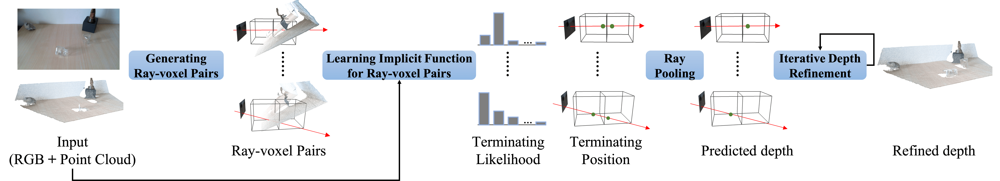

# RGB-D Local Implicit Function for Depth Completion of Transparent Objects
### [[Project Page]](https://research.nvidia.com/publication/2021-03_RGB-D-Local-Implicit) [[Paper]](https://arxiv.org/pdf/2104.00622.pdf)
<div>

</div>

## Overview
This repository maintains the official implementation of our CVPR 2021 paper: 

**RGB-D Local Implicit Function for Depth Completion of Transparent Objects**

By Luyang Zhu, Arsalan Mousavian, Yu Xiang, Hammad Mazhar, Jozef van Eenbergen, Shoubhik Debnath, Dieter Fox


## Requirements
The code has been tested on the following system:

- Ubuntu 18.04
- Nvidia GPU (4 Tesla V100 32GB GPUs) and CUDA 10.2
- python 3.7
- pytorch 1.6.0

## Installation
### Docker (Recommended)
We provide a [Dockerfile](Dockerfile) for building a container to run our code. More details about GPU accelerated Docker containers can be found [here](https://github.com/NVIDIA/nvidia-docker).
### Local Installation
We recommend creating a new conda environment for a clean installation of the dependencies.
```
conda create --name lidf python=3.7
conda activate lidf
```
Make sure CUDA 10.2 is your default cuda. If your CUDA 10.2 is installed in `/usr/local/cuda-10.2`, add the following lines to your `~/.bashrc` and run `source ~/.bashrc`:
```
export PATH=$PATH:/usr/local/cuda-10.2/bin
export LD_LIBRARY_PATH=$LD_LIBRARY_PATH:/usr/local/cuda-10.2/lib64
export CPATH=$CPATH:/usr/local/cuda-10.2/include
``` 
Install libopenexr-dev
```
sudo apt-get update && sudo apt-get install libopenexr-dev
``` 
Install dependencies, we use ${REPO_ROOT_DIR} to represent the working directory of this repo.
```
cd ${REPO_ROOT_DIR}
conda install pytorch==1.6.0 torchvision==0.7.0 cudatoolkit=10.2 -c pytorch
pip install -r requirements.txt
```

## Dataset Preparation
### ClearGrasp Dataset
ClearGrasp can be downloaded at their [official website](https://sites.google.com/view/cleargrasp/data) (Both training and testing dataset are needed). After you download zip files and unzip them on your local machine, the folder structure should be like
```
${DATASET_ROOT_DIR}
├── cleargrasp
│   ├── cleargrasp-dataset-train
│   ├── cleargrasp-dataset-test-val
```
### Omniverse Object Dataset
Omniverse Object Dataset can be downloaded [here](https://drive.google.com/drive/folders/1wCB1vZ1F3up5FY5qPjhcfSfgXpAtn31H?usp=sharing). After you download zip files and unzip them on your local machine, the folder structure should be like
```
${DATASET_ROOT_DIR}
├── omniverse
│   ├── train
│   │	├── 20200904
│   │	├── 20200910
```
### Soft link dataset
```
cd ${REPO_ROOT_DIR}
ln -s ${DATASET_ROOT_DIR}/cleargrasp datasets/cleargrasp
ln -s ${DATASET_ROOT_DIR}/omniverse datasets/omniverse
```

## Testing
We provide pretrained checkpoints at the [Google Drive](https://drive.google.com/file/d/1EHJfWCO6QV2hby87rTNLpbBrIdF4nYpP/view?usp=sharing). After you download the file, please unzip and copy the `checkpoints` folder under ${REPO_ROOT_DIR}.

Change the following line in `${REPO_ROOT_DIR}/src/experiments/implicit_depth/run.sh`:
```
# To test first stage model (LIDF), use the following line
cfg_paths=experiments/implicit_depth/test_lidf.yaml
# To test second stage model (refinement model), use the following line
cfg_paths=experiments/implicit_depth/test_refine.yaml
```
After that, run the testing code:
```
cd src
bash experiments/implicit_depth/run.sh
```

## Training

### First stage model (LIDF)
Change the following line in `${REPO_ROOT_DIR}/src/experiments/implicit_depth/run.sh`:
```
cfg_paths=experiments/implicit_depth/train_lidf.yaml
```
After that, run the training code:
```
cd src
bash experiments/implicit_depth/run.sh
```

### Second stage model (refinement model)
In `${REPO_ROOT_DIR}/src/experiments/implicit_depth/train_refine.yaml`, set `lidf_ckpt_path` to the path of the best checkpoint in the first stage training. Change the following line in `${REPO_ROOT_DIR}/src/experiments/implicit_depth/run.sh`:
```
cfg_paths=experiments/implicit_depth/train_refine.yaml
```
After that, run the training code:
```
cd src
bash experiments/implicit_depth/run.sh
```

### Second stage model (refinement model) with hard negative mining
In `${REPO_ROOT_DIR}/src/experiments/implicit_depth/train_refine_hardneg.yaml`, set `lidf_ckpt_path` to the path of the best checkpoint in the first stage training, set `checkpoint_path` to the path of the best checkpoint in the second stage training. Change the following line in `${REPO_ROOT_DIR}/src/experiments/implicit_depth/run.sh`:
```
cfg_paths=experiments/implicit_depth/train_refine_hardneg.yaml
```
After that, run the training code:
```
cd src
bash experiments/implicit_depth/run.sh
```

## License
This work is licensed under [NVIDIA Source Code License - Non-commercial](LICENSE).


## Citation
If you use this code for your research, please citing our work:

```latex
@inproceedings{zhu2021rgbd,
author    = {Luyang Zhu and Arsalan Mousavian and Yu Xiang and Hammad Mazhar and Jozef van Eenbergen and Shoubhik Debnath and Dieter Fox},
title     = {RGB-D Local Implicit Function for Depth Completion of Transparent Objects},
booktitle = {IEEE Conference on Computer Vision and Pattern Recognition (CVPR)},
year      = {2021}
}
```